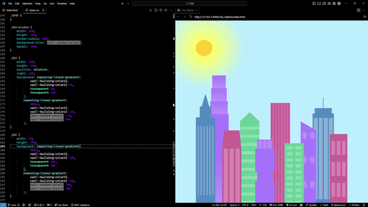

# Mini Project: City Skyline

## Description

A CSS project to practice CSS Variables and media queries. This project is a simple webpage with a city skyline background. The project is designed to switch between day and night mode using CSS Variables and media queries.

**Make your browser window smaller to switch between modes**

## Features

-   CSS Variables
-   Media Queries
-   Linear Gradients
-   Flex Box
-   Responsive Design

## Live Demo

[City Skyline](https://eddking-qs.github.io/CSS-Mini_Projects-City_Skyline/)

## Disclaimer

-   This project will not be updated or maintained. It is a simple project to practice CSS Variables and media queries.

Feel fork this project and style it as you wish.

Don't forget to star ⭐ this project if you like it!
